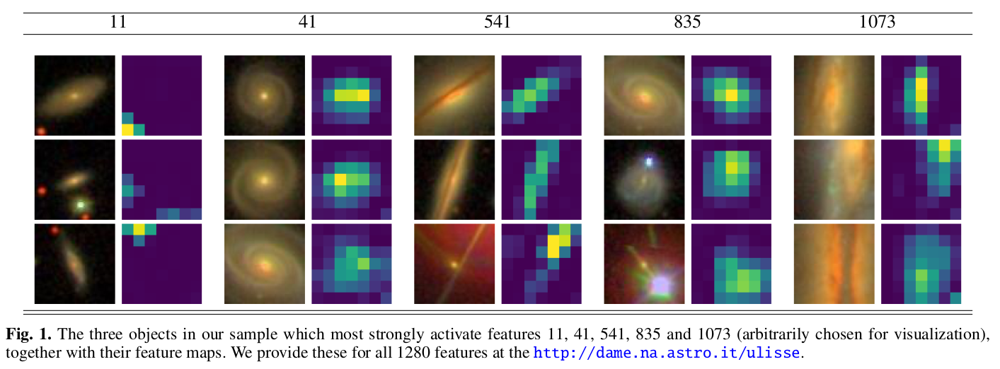
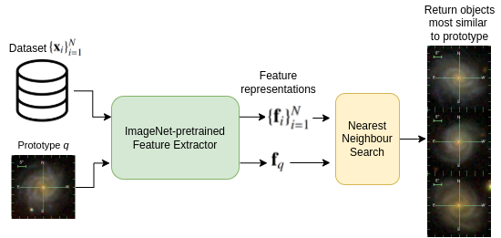

# ULISSE
Code for [ULISSE: A tool for one-shot sky exploration and its application for detection of active galactic nuclei](https://www.aanda.org/articles/aa/abs/2022/10/aa43900-22/aa43900-22.html). 



## Loading data

The `get_data.py` file reads in a csv file containing coordinates, and outputs 2 files: their images in `dr16.npz`, and the indices of these images in the given csv file (done as some objects fail to be retrieved from the ImgCutout service). 

Change line 15 in `get_data.py` to read in the desired csv file with a column ra and dec for each object, for example from a query to the SDSS.

## Running ULISSE



Using the .npz file obtained from `get_data.py` (loaded in the `get_data` function), the `ULISSE.ipynb` notebook can be used to find nearest neighbours (the lookalikes) for any given query, after running the whole notebook, using the last cell.

First, it obtains its image by passing its ra and dec coordinates to the `get_query` function. Then, it find the nearest neighbours with the `get_nns` function, and visualizes the result with the `plot` function .

### Citation

If you find this work helpful, consider citing it using

```
@article{doorenbos2022ulisse,
  title={ulisse: A tool for one-shot sky exploration and its application for detection of active galactic nuclei},
  author={Doorenbos, Lars and Torbaniuk, Olena and Cavuoti, Stefano and Paolillo, Maurizio and Longo, Giuseppe and Brescia, Massimo and Sznitman, Raphael and M{\'a}rquez-Neila, Pablo},
  journal={Astronomy \& Astrophysics},
  volume={666},
  pages={A171},
  year={2022},
  publisher={EDP Sciences}
}
```
